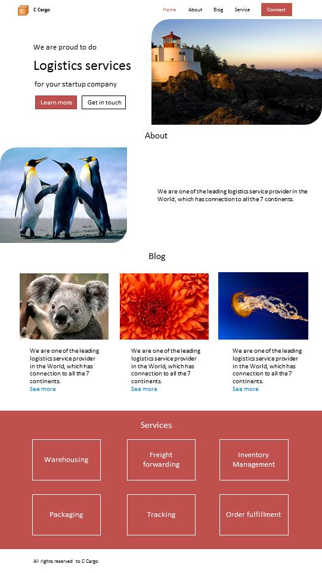

<html lang="en">
<head>
    <meta charset="UTF-8" />
	<meta name="description" content="Digital Marketing Service" />
	<meta name="keywords" content="Reynodyn, reynodyn, marketing, seo, target ad, digital marketing,affiliate marketing, social media marketing, marketing 

strategy, email marketing, marketing plan, advertising agency, internet marketing, digital marketing course, e marketing, seo services, direct marketing, digital 

marketing agency, seo company, what is digital marketing,b2b marketing, marketing online, Best marketing agency, SEO agency, marketing agency, social marketing, 

marketing research, web marketing, online advertising, Digital Marketing Services, Web Design and Development, Lead Generation, Marketing Automation, SEO Services, 

Search Engine Optimization, PPC,  Advertising, Pay-Per-Click, Content Marketing, Influencer Marketing, Content Strategy, Brand Management, conversion Rate 

optimization, Web Analytics Services, Digital Advertising, E-commerce Marketing, Mobile Marketing, Online Marketing, Digital Marketing Services" />
	<meta name="author" content="Alias Thomas" />
	<meta name="viewport" content="width=device-width, initial-scale=1.0" />
<title>Digital Marketing Business</title>
<link rel="shortcut icon" type="image/x-icon" href="https://reynodyn.github.io/files/img/Re.jpg" />
    
</head>
<body>
    <nav>
        <a href="#home">Home</a> |
        <a href="#services">Services</a> |
        <a href="#about">About Us</a> |
        <a href="#contact">Contact</a>
    </nav>
    

        <section id="home" class="section">
            <h1>Transform Your Business with Reynodyn</h1>
            
Ideal for founders, product managers, and innovators who want to grow online with creative web design, effective SEO, and data-driven marketing strategies

            <a href="#contact" class="cta-button">Get Started</a>
        </section>

        <section id="services" class="section">
            <h2>Our Services</h2>
    

      

        <h3>Web Design</h3>
        
We create visually stunning, user-friendly websites that drive results and make a lasting impression.

      

      

        <h3>SEO Optimization</h3>
        
Improve your website's ranking on search engines with our proven SEO strategies.

      

      

        <h3>Social Media Marketing</h3>
        
Engage your audience and grow your brand through targeted social media campaigns.

      

      

        <h3>E-commerce</h3>
        
Build powerful online stores with seamless shopping experiences.

      

    

    <h2>Our Portfolio</h2>
    

      

        
      

      

        
      

      

        
      

      

        
      

    

  </section>

        
        <section id="about" class="section">
            <h2>About Us</h2>
            
We are built to change future. We serves as a strategic partner for businesses, specializing in promoting products or services to target audiences 

effectively. We conduct comprehensive market research to understand consumer behavior, trends, and competitors. Our goal is to build user-friendly, responsive, and visually captivating websites that help businesses succeed online.

        </section>
        <section id="contact" class="section">
            <h2>Contact Us</h2>
            
Get in touch with us to discuss your digital marketing strategy.

            <address>

<form>
      <input type="text" name="name" placeholder="Your Name" required>
      <input type="email" name="email" placeholder="Your Email" required>
      <textarea name="message" rows="5" placeholder="Your Message" required></textarea>
      <button type="submit">Send Message</button>
    </form>

                Email: <a href="mailto:reynodyn@gmail.com">reynodyn@gmail.com</a> 
	<a href="https://www.facebook.com/profile.php?id=61563869305756" target="_blank">Facebook</a> |
	<a href="https://www.instagram.com/reynodyn/" target="_blank">Instagram</a> | 
	<a href="https://www.linkedin.com/company/reynodyn" target="_blank">LinkedIn</a> | 
        <a href="https://www.youtube.com/@reynodyn" target="_blank">You Tube</a>
            </address>
        </section>
    

    <footer>
        
&copy; 2024 Reynodyn. All Rights Reserved.

    </footer>
</body>
</html>
